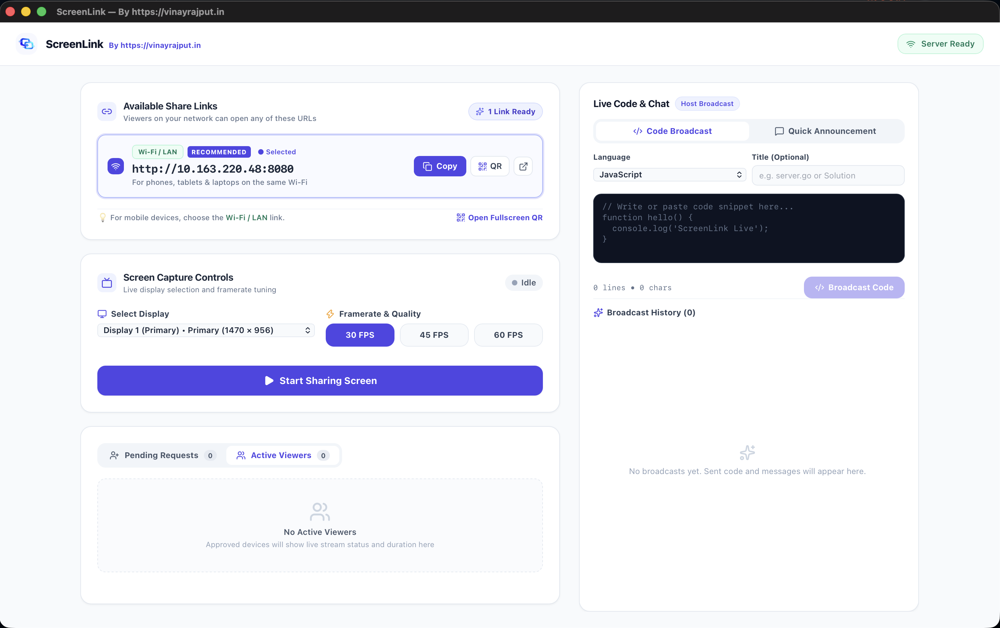
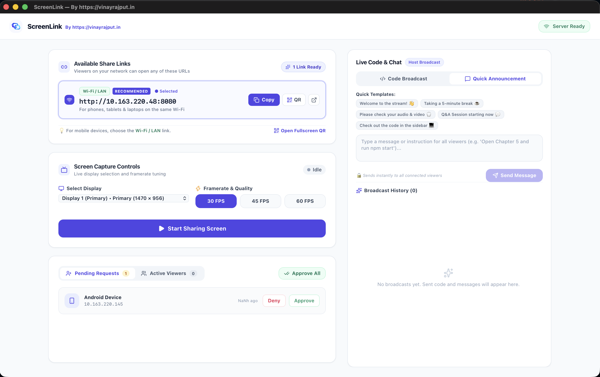
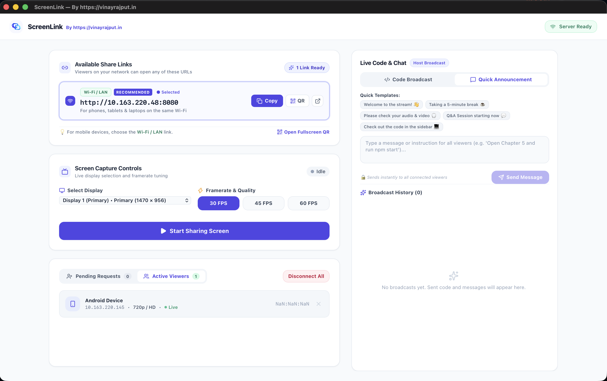
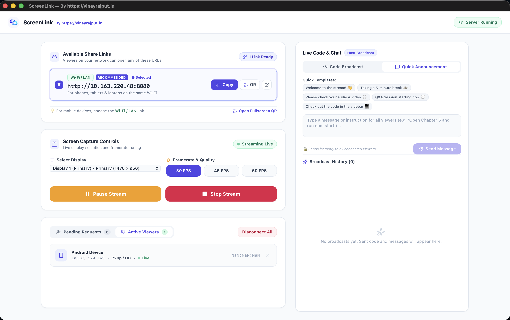

# 🖥️ ScreenLink

**Fast, private, local screen sharing — directly in your browser.**

ScreenLink is a lightweight, open-source screen sharing app for devices connected to the same **Wi-Fi or LAN**.

Viewers don't need to install anything. Just open the ScreenLink URL in a browser, request access, and wait for host approval.

Built with **Go, Wails v2, React 19, TypeScript, Tailwind CSS, and WebSockets**.

---

## 📥 Download

Get the latest stable version of ScreenLink for **macOS and Windows**.

<a href="https://github.com/vinayrajput05/ScreenLink/releases/latest">
  
</a>

👉 **[View All Releases](https://github.com/vinayrajput05/ScreenLink/releases)**

---

## ✨ Features

* 🌐 **Zero-Install Viewer** — Open the host URL in any modern browser.
* 🔐 **Host Approval** — Every viewer must request permission.
* ⚡ **Live Screen Streaming** — Real-time streaming over WebSockets.
* 💬 **Host Announcements** — Send text, links, instructions, or code snippets.
* 📡 **Works Offline** — No cloud server, account, or Internet required.
* 📱 **Cross-Device** — Works on phones, tablets, laptops, and desktops.

---

## 📸 Screenshots

| 🖥️ Main Dashboard | 🔐 Viewer Permission Request |
| :---: | :---: |
|  |  |

| 👥 Connected Viewers | ⚡ Live Screen Streaming |
| :---: | :---: |
|  |  |

---

## 🚀 How It Works

```text
ScreenLink Host
      │
      │ Wi-Fi / LAN
      ▼
Viewer Browser
      │
      ▼
Request Access
      │
      ▼
Host Approves
      │
      ▼
Live Screen
```

---

## 🛠️ Tech Stack

| Area      | Technology   |
| --------- | ------------ |
| Backend   | Go           |
| Desktop   | Wails v2     |
| Frontend  | React 19     |
| Language  | TypeScript   |
| Styling   | Tailwind CSS |
| Streaming | WebSockets   |
| Viewer    | HTML5 Canvas |

---

## 💻 Development

### Requirements

* Go 1.20+
* Node.js 18+
* Wails CLI v2

Install Wails:

```bash
go install github.com/wailsapp/wails/v2/cmd/wails@latest
```

Clone the repository:

```bash
git clone https://github.com/vinayrajput05/ScreenLink.git
cd ScreenLink
```

Install dependencies:

```bash
cd frontend
npm install
cd ..
```

### 🍎 macOS

If Go, Wails, or Homebrew commands are not found, add them to your `PATH`:

```bash
export PATH=$PATH:/opt/homebrew/bin:$HOME/go/bin
```

Then verify Wails:

```bash
wails version
```

You can also add the PATH permanently:

```bash
echo 'export PATH=$PATH:/opt/homebrew/bin:$HOME/go/bin' >> ~/.zshrc
source ~/.zshrc
```

### Run ScreenLink

```bash
wails dev
```

---

## 🧪 Test Screen Sharing

1. Start ScreenLink.
2. Click **Start Sharing Screen**.
3. Open the displayed URL on another device using the same Wi-Fi/LAN.
4. Enter your name and click **Request Screen Access**.
5. Approve the request from the host app.
6. Start viewing the screen.

Example:

```text
http://192.168.1.10:8080
```

---

## 📦 Build

### 🍎 macOS

```bash
export PATH=$PATH:/opt/homebrew/bin:$HOME/go/bin
wails build -platform darwin/arm64
```

**Output:**
```text
build/bin/ScreenLink.app
```

**Create a Drag & Drop macOS DMG Installer:**
```bash
./scripts/build-dmg.sh
```
Or using `create-dmg`:
```bash
create-dmg \
  --volname "ScreenLink Installer" \
  --window-pos 200 120 \
  --window-size 600 360 \
  --icon-size 100 \
  --icon "ScreenLink.app" 150 170 \
  --hide-extension "ScreenLink.app" \
  --app-drop-link 450 170 \
  --no-internet-enable \
  build/bin/ScreenLink-Installer.dmg \
  build/bin/ScreenLink.app
```

### 🪟 Windows

```bash
wails build -platform windows/amd64 -nsis
```

---

## 🤝 Contributing

Contributions are welcome! ❤️

You can help with:

* 🐛 Bug fixes
* ✨ New features
* 🎨 UI improvements
* ⚡ Performance
* 📖 Documentation
* 🧪 Testing
* 🍎 macOS support
* 🪟 Windows support

Create a branch:

```bash
git checkout -b feature/my-feature
```

Make your changes, test them, and open a **Pull Request**.

Look for issues labeled:

`good first issue` • `help wanted` • `bug` • `enhancement`

---

## 🗺️ Roadmap

* [ ] Multi-monitor selection
* [ ] Window sharing
* [ ] Stream quality controls
* [ ] Viewer statistics
* [ ] QR code connection
* [ ] Better reconnect support
* [ ] Windows optimization
* [ ] Linux host support
* [ ] Optional HTTPS

Have an idea? **Open an issue and share it.**

---

## 🔒 Privacy

ScreenLink is designed for **trusted local networks**.

**No cloud relay. No account. No Internet required.**

> Your screen shouldn't need to travel through the cloud to reach a device sitting next to you.

---

## ⭐ Support ScreenLink

If you like the project:

**⭐ Star • 🍴 Fork • 🐛 Report Bugs • 💡 Suggest Features • 🤝 Contribute**

### ☕ Support the Developer

If ScreenLink is useful to you and you'd like to support its development:

**❤️ [Support Me](https://razorpay.me/@vinayrajput05)**

<a href="https://razorpay.me/@vinayrajput05">
  
</a>

Your support helps keep ScreenLink open source and improving. 🚀
